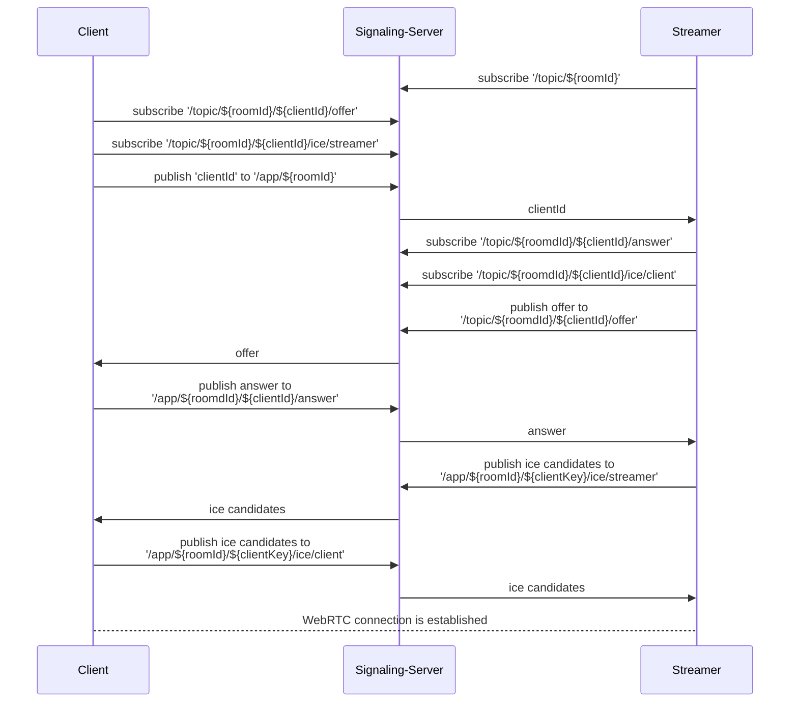
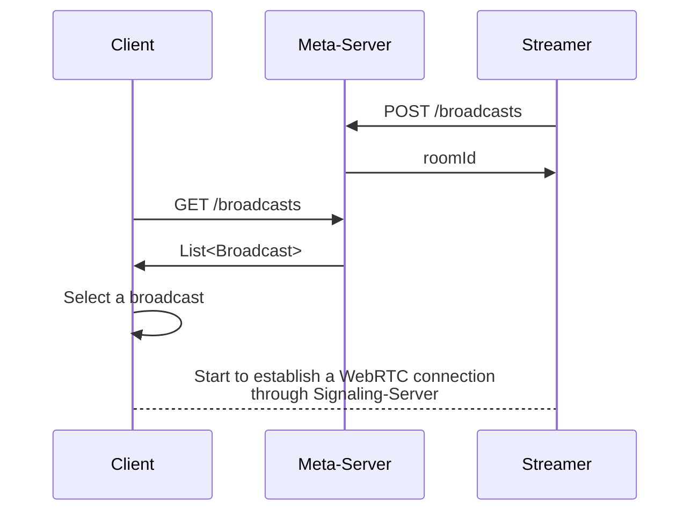

# Live Streaming

## 프로젝트 개요

실시간 비디오 스트리밍 서비스의 시스템 설계와 구현을 위한 스터디를 위해서 만들어진 프로젝트입니다. 

Twitch, 치지직과 같은 상용 서비스를 참고하여 실시간 비디오 스트리밍 서비스의 Core 기능과 지표를 목표로 설계와 구현을 진행하였습니다. 

방송 URL: [https://5jyo.site/streamer](https://5jyo.site/streamer)

시청 URL: [https://5jyo.site/client](https://5jyo.site/client)

| Streamer Page | Viewer Page |
| - | - |
|  |  |

### 설계목표

- 10초 미만의 스트리밍 딜레이
- 방송 리스트, 간단한 검색
- 실시간 시청자 수를 표시
- 최대 만명의 동시 시청자
- 스트리밍 서버 장애가 서비스에 영향이 없는 구조
- 무중단(에 가까운) 배포가 가능한 구조
- 480p, 720p 화질을 시청자가 선택가능

### 주 기능

- Actor: Streamer
    - 스트리밍 방송 생성 및 방송 송출
    - 스트리밍 시청자 채팅 확인
- Actor: Viewer
    - 스트리밍 방송 목록 및 시청자 수 확인
    - 스트리밍 방송 시청
    - 스트리밍 내 채팅 시스템

## 빌드 및 실행 방법

- 빌드
    
    ```kotlin
    ./gradlew bootJar
    ```
    
- 실행 #1 (도커)
    
    ```kotlin
    docker-compose up -d
    ```
    
- 실행 #2 (gradle)
    
    ```kotlin
    ./gradlew :api-meta:bootRun
    ./gradlew :api-signaling:bootRun
    ```
    

## 시스템 아키텍처


## 기술스택

- Back-end
    - Java (21)
    - kotlin (1.9.22)
    - springboot (3.2.3)
        - STOMP WebSocket
        - thymeleaf
        - H2
        - JPA
    - coturn (4.6.2)
- Front-end
    - HTML
    - CSS
    - websocket
        - StompJS
    - webRTC

## 컴포넌트

### Signaling-Server

- WebRTC 중개 서버로 WebRTC 연결에 필요한 offer, answer, ice message 를 WebSocket을 통해서 중개하는 역할을 합니다.
- 우리는 WebSocket을 통한 메시지 전송 구현을 간편하게 하기 위해서 stomp 라는 메시지 전송 프로토콜을 사용했습니다.  stomp 를 이용하여 구현하면 pub/sub 구조로 메시지를 서로 주고 받을 수 있습니다.
- client 를 구분하기 위해서, client에서는 무작위로 key를 생성합니다. 이 clientKey 를 stomp 의 메시지 전달 경로에 추가하여 특정 client 와 streamer 간에 메시지를 주고 받을 수 있도록 합니다.
- WebSocket Controller 구조
    - subscribe 의 경우 prefix로 /topic 이 붙으며, publish 하는 경우 /app 를 붙여야합니다.
    - `/${roomId}`
        - Client 가 자신의 key를 전달할 때 사용합니다.
    - `/${roomId}/${clientKey}/offer`
        - Streamer 가 Client 에게 offer를 전달 할 때 사용합니다.
    - `/${roomId}/${clientKey}/answer`
        - Client 가 Streamer 에게 answer 를 전달할 때 사용합니다.
    - `/${roomId}/${clientKey}/ice/streamer`
        - Streamer 가 Client 에게 ICE candidate 전달할 때 사용합니다.
    - `/${roomId}/${clientKey}/ice/client`
        - Client 가 Streamer 에게 ICE candidate 전달할 때 사용합니다.
- 전체적인 흐름은 아래와 같이 Sequence Diagram 으로 그려볼 수 있습니다.



- 부가 기능
    - 현재 방송을 시청중인 시청자수를 알 수 있도록 API를 제공합니다. Room 마다 연결되어있는 Client 의 websocket connection 개수를 세는 방식으로 구현하였습니다.

### Meta Server

- 방송 목록을 관리해주는 서버입니다. Streamer 가 방송을 시작하기전에 meta server 에 방송을 등록하고 방번호를 가져옵니다. Client 는 meta 서버를 통해서 현재 진행중인 방송 목록을 가지고 올 수 있습니다.
- DB Schema
    
    broadcast
    
    | Column Name | Column Type | Other |
    | --- | --- | --- |
    | broadcast_id | Long | PK, websocket 방 식별자로 사용 |
    | name | Varchar |  |
    | description | Varchar |  |
    | started_at | Timestamp |  |
    | ended_at | Timestamp |  |
    | created_at | Timestamp |  |
    | modified_at | Timestamp |  |
    | status | Varchar | READY / STREAMING / CLOSED |
    | viewer_count | Int |  |
- API 목록
    - 방송 목록 조회
        - GET /broadcasts
    - 방송 등록
        - POST /broadcasts
    - 방송 종료
        - PUT /broadcasts/{broadcast_id}
- Signaling Server 와 마찬가지로 전체적인 흐름을 Sequence Diagram으로 그려보면 아래와 같이 됩니다.



### TURN 서버

- 스트리머 또는 시청자의 NAT 보안설정으로 인하여 P2P 연결이 불가능할때, 방송 트래픽을 중계하는 기능을 담당합니다.
- 오픈소스 Coturn 프로젝트를 기반으로 동작합니다.
- [https://github.com/coturn/coturn](https://github.com/coturn/coturn)

# 주차별 진행사항

### 1주차 (2024-02-20)

3명의 멤버가 모여서 어떤 주제로 설계 & 구현 프로젝트를 진행할지 논의했습니다. 미리 모이기 전에 원하는 주제와 요건을 생각해오기로 했는데요, 다양하고 재미있는 주제들이 나왔습니다. 

<스터디 주제 후보>

- URL Shortener
    - 같이 공부한 **[가상 면접 사례로 배우는 대규모 시스템 설계 기초](https://product.kyobobook.co.kr/detail/S000001033116)** 책에 나온 주제
    - 비즈니스 로직이 간단하고, 직접 일상생활에서 사용할 수 있음
- Rate Limiter
    - 같이 공부한 **[가상 면접 사례로 배우는 대규모 시스템 설계 기초](https://product.kyobobook.co.kr/detail/S000001033116)** 책에 나온 주제
    - local, global 상황을 고려한 디자인을 해볼수 있음
- WebRTC를 이용한 영상통화
    - 1:1, 1:N 상황별로 어떻게 처리할지가 포인트
    - LINE 에서 음성통화를 직접 개발중인 재형님이 제안
- (Video)Live Streaming
    - 트위치, 치지직과 유사한 기능
    - 대용량 파일의 처리를 배울 수 있음
    - Scalability 테스트가 어려울 수 있음

여러 멤버들이 Live Streaming 서비스에 관심이 있었지만, 평소에 개발하는 분야가 아닌 영상과 관련된 개발이기 때문에 기술적으로 과하게 어렵지 않을까 하는 우려가 있었습니다. 미지의 영역이 너무 많았기 때문에 저희는 주제를 최종 결정하기 전에 다음주까지 Video Live Streaming과 관련하여 각자 리서치를 진행해서 오기로 했습니다. 

### 2주차 (2024-02-26)

Live Streaming 서비스의 경우 시스템 설계 면접 주제로 종종 나오기 때문에, 유투브와 기술 블로그에서 참고할만한 자료를 찾을 수 있었습니다. 

[Twitch Engineering: An Introduction and Overview](https://blog.twitch.tv/en/2015/12/18/twitch-engineering-an-introduction-and-overview-a23917b71a25/)

[How Does Live Streaming Platform Work? (YouTube live, Twitch, TikTok Live)](https://youtu.be/7AMRfNKwuYo?si=z_wvesGLl18YULV3)

[System Design — Live Streaming to millions](https://medium.com/@saurabh.codes/system-design-live-streaming-to-millions-1739fc748ef8)

리서치를 통해서 Live Streaming 서비스의 경우 크게 시청자에게 영상을 전달하기 위해서 HLS 또는 WebRTC 기술을 사용한다는 사실을 알 수 있었습니다. 

이를 기반으로 Miro에서 아래와 같은 시스템 설계 초안을 진행하였습니다. 

<HLS 기반의 전체 시스템 디자인>


구현방법을 위해서 리서치를 진행한 결과, nginx의 HLS 모듈을 사용하여 RTMP로 업로드된 비디오 파일을 HLS 형식으로 변환하고 nginx 서버를 통해서 인코딩된 HLS 파일을 제공하는 것이 가능하다는 것을 알게 되었습니다. 

GitHub에서 예시로 작성된 docker 기반의 프로젝트를 찾게 되어서 바로 빠르게 테스트를 진행해 보았습니다. 

[https://github.com/TareqAlqutami/rtmp-hls-server](https://github.com/TareqAlqutami/rtmp-hls-server)

오픈소스 비디오 녹화, 중계 프로그램인 [OBS Studio](https://obsproject.com/ko)를 사용하여, docker로 구동한 서버에 비디오를 업로드하고 로컬에 띄운 브라우저 페이지에서 HLS로 중계 시청이 가능한 것을 확인하였습니다. Latency를 확인하기 위해서 스탑워치를 녹화하고, 방송되는 화면에서 나오는 시간대와 비교하였고 이때 30~40초의 지연시간이 발생하는 것을 확인할 수 있었습니다. 

전체적인 방향성은 확인을 했지만 아직도 RTMP, HLS, WebRTC, 동영상 인코딩 처리 등의 기술과 관련하여 기반지식이 부족했기 때문에 다음주까지 분담하여 개별 기술에 대한 리서치를 진행하기로 결정하였습니다. 

### 3주차 (2024-03-05)

RTMP, HLS, Encoding과 관련되어서 각자 리서치해온 내용을 공유하였습니다. 

[RTMP](https://www.notion.so/RTMP-cbb6d5e76ec54e43b35ab2484c30ea93?pvs=21)

[HLS](https://www.notion.so/HLS-2a8f711b03dd4506a959b174567e9ed0?pvs=21)

[Encoding](https://www.notion.so/Encoding-a078c56b19d648ca97196cce8e988047?pvs=21)

이 시점에는 Live Streaming으로 이번 스터디의 주제를 결정하기로 하였고, 이에 따라서 설계목표를 정의하기 위해 다양한 요구사항을 브레인스토밍하고, 이 중에 가장 중요하다고 판단되는 Core 요구사항을 정리하였습니다. 

스터디의 목표가 상용 서비스의 구현이 아닌 시스템 설계와 구현에 따른 요소를 공부하는 것이 목적이었기 때문에, 핵심 기능 이외의 채팅 등의 서브 기능들은 제외하고 트래픽 수치와 가용성을 목표로 설정하였습니다.  

<Core 요구사항>

- Twitch 같이 라이브 비디오 스트리밍을 할 수 있는 서비스
- 방송 리스트, 간단한 검색
- 유저가 선택하는 화질 → 720p, 480p (2개만)
- 실시간 시청자 수를 표시
- 지연지간 → 10초 목표
- 동시 시청자 10000명 수용 가능
- 일부 스트리밍 서버가 죽는 상황도 감당이 가능해야 함
- 무중단(에 가까운) 배포

이 중에서 처음부터 어려움이 느껴졌던 요구사항은 10초의 지연시간이었습니다. 트위치, 치지직과 같은 방송 플랫폼에서는 스트리머와 시청자의 소통을 위해서 이런 지연시간을 짧게 제공하고 있습니다. 

저희도 이 부분이 서비스의 가장 중요한 설계 포인트라고 생각하였습니다. 다만 이미 HLS 기반의 Prototype을 검토해봤을때 30~40초의 지연시간을 확인했고, 이때 체감 상 정말 긴 시간차가 존재하는 것을 느꼈기 때문에 다른 대안을 검토할 필요성이 있었습니다. 

이에 따라서 HLS 보다 짧은 latency를 보장하는 기술인 WebRTC를 추가적으로 검토하기로 결정하였습니다. 

### 4주차 (2024-03-12)

WebRTC에 대한 리서치 내용을 화이트보드를 이용하여 세션 형식으로 공유하였습니다. WebRTC의 기반이 되는 SRTP, ICE 등의 프로토콜과 이를 기반으로 어떻게 P2P 연결이 이루어지는지, 그리고 symmetric NAT 이슈를 해결하기 위해 STUN, TURN 서버들이 필요한 이유에 대해서 다같이 공유하였습니다. 

[WebRTC 리서치](https://www.notion.so/WebRTC-dff9df600d2d49229379624851e90216?pvs=21)


또다른 멤버의 경우 WebRTC를 이용한 영상통화 서비스 개발 튜토리얼을 이용해서 실제로 로컬에서 동작하는 영상통화 서비스 Prototype을 구현해서 시연하였습니다. Live Streaming 서비스와 유사한 부분이 많아 추후 이 Prototype을 기반으로 Live Streaming 서비스를 구현해나가게 되었습니다. 

처음부터 모든 요구사항을 만족하는 시스템을 구현하는 것은 어려울 것으로 판단했기 때문에, 간단한 구조에서 출발한 이후 테스트를 진행하면서 지연시간, 트래픽 요구사항을 만족하기 위해서 시스템을 개선해나가기로 결정하였습니다. 

TURN, SFU 컴포넌트는 일단 배제하고 MetaData 서버와 Signaling 서버 두가지 컴포넌트가 존재하는 간단한 디자인을 최초 설계로 채택하였고 이를 기반으로 API 와 DB Scheme를 설계하였습니다. (아키텍처 설계 참조)


### 5주차 (2024-03-19)

설계가 마무리 되었기때문에 GitHub Repository를 세팅하고 본격적으로 구현을 진행하였습니다. 각자 시간이 있을 경우 미리 개발을 진행해오고, 스터디 시간에는 서로 구현한 내용을 리뷰하고 병합하는 시간을 가졌습니다. 

WebSocket을 그대로 사용하기에는 구현내용이 많아질 것을 우려하여 Signaling 서버에서는 Spring에서 지원하는 STOMP 프로토콜을 기반으로 ICE Candidate 교환을 구현하기로 결정하였습니다. 개별 방송과 시청자별로 endpoint를 지정하여 스트리머와 시청자가 WebRTC Offer, Answer를 교환할 수 있도록 하였습니다. 
(아키텍처 설계 - WebSocket Controller 구조 참조)


### 6주차 (2024-03-26)

MetaData 서버, Signaling 서버의 구현이 어느정도 완료되어서 작성한 코드를 병합하고 로컬 PC에서 구동 테스트를 진행하였습니다. 

[https://github.com/5jyo/live-streaming](https://github.com/5jyo/live-streaming)

같은 Wifi 망에서 1개의 PC에서 MetaData 서버, Signaling 서버를 구동하고 해당 PC의 내부 IP, Port를 공유하여 접속이 가능한지 확인하였습니다. 테스트 결과 같은 Wifi 망에 속한 다른 PC에서도 접속하여 방송 시청이 가능한 것을 확인하였습니다. 

WebRTC의 경우에는 브라우저 API의 지원이 우수하기 때문에, OBS Studio와 같은 별도 송출 프로그램을 사용하지 않고도 브라우저 상에서 방송 송출과 시청을 진행할 수 있었고 추가적으로 Wifi 망에 연결된 모바일 기기로도 시청이 가능한 것을 확인하였습니다. 

P2P 연결을 통해서 낮은 latency를 보장하는 WebRTC 기술의 특성과, network hop이 적은 동일 wifi 망 덕분에 200ms 가량의 우수한 latency를 확인할 수 있었습니다. 


### 7주차 (2024-04-02)

Wifi 망이 아닌 외부 인터넷망에서도 서비스를 사용할 수 있도록 AWS를 이용한 배포환경 구축을 시작하였습니다. 

회사에서 이미 세팅되어있는 배포환경을 사용하는 것과 달리, 직접 운영, 배포환경 구축을 위해서 필요한 다양한 인프라 작업을 경험하게 되었습니다. 

<AWS 작업>

- 도메인 구입 및 DNS 설정
- VM 인스턴스 발급 및 java 설치 등 환경 세팅
- Load Balancer 설정
- 각 컴포넌트의 inbound, outbound 트래픽 관련 네트워크 보안 설정

서비스를 장기간 운영하는 것을 상정하지 않았기 때문에, 별도의 CI/CD pipeline이나 Docker를 이용한 환경은  구성하지 않고 로컬에서 빌드한 jar 파일을 scp로 업로드하여 직접 VM에서 구동하는 방법을 채택하였습니다. 

### 8주차 (2024-04-09)

AWS 환경 구축을 마무리하고 실제로 외부망에서의 서비스 사용을 테스트하였습니다. 

방송 URL: [https://5jyo.site/streamer](https://5jyo.site/streamer)

시청 URL: [https://5jyo.site/client](https://5jyo.site/client)

같은 Wifi 망 내부에서는 정상적으로 방송과 시청이 가능한 것을 확인했지만, LTE 네트워크 등 Wifi 망 외부에서의 시청이 불가능한 이슈를 확인하였습니다. 이슈를 디버깅하기 위해서 Chrome WebRTC Debugger를 사용했고, 외부망의 경우 P2P 연결을 위한 ICE Candidate 선정에 실패하는 것을 확인할 수 있었습니다. 

디버깅과 리서치 결과 해당 이슈는 WebRTC 기술 리서치를 진행할때 언급되었던 Symmetric NAT 환경에서 Signaling 중개서버를 경유한 P2P 연결 수립이 불가능한 이슈인 것을 확인하였습니다. 

NAT의 보안설정에서 Wifi망 외부로 접근시 사용한 ip:port mapping에서 오는 traffic을 만을 허용하는 경우, 시청자 입장에서 직접 API 요청을 보낸 서버인 MetaData 서버, Signaling 서버로부터의 트래픽은 수용할 수 있지만 제3자인 Streamer로부터 오는 트래픽은 거부하게 됩니다. 

해당 이슈를 해결하기 위해서는 트래픽을 중계해주는 TURN 서버가 필요한 것을 알게 되었고, 이를 위해서 별도의 TURN 서버 VM을 추가하였습니다. TURN 서버의 구현체로는 [오픈소스 Coturn](https://github.com/coturn/coturn)을 이용하여 간단하게 트래픽을 Relay 해주는 TURN 서버를 구축할 수 있었습니다.  

### 9주차 (2024-04-16)

TURN 서버 추가 이후에 외부망으로도 방송 송출과 시청이 가능한 것을 확인하였고, 마지막으로 현재 시스템 구조가 Traffic을 얼마까지 수용할 수 있는지 부하 테스트를 진행하였습니다. 

nGrinder, Locust 등의 툴을 이용하여 인위적인 부하를 생성할수 있는 REST API와 다르게, WebRTC의 경우는 지속되는 P2P 연결과 비디오 송출, 수신이 요구되어서 난항을 겪었습니다. 리서치 결과 오픈소스도 잘 관리된 도구를 확인하지 못했고, [https://testrtc.com](https://testrtc.com/) 와 같은 상용 서비스는 유료결제를 요구하였습니다. 

리서치에 큰 도움이 되었던 [NHN WebRTC 부하 테스트 발표영상](https://youtu.be/fojCaHHJ6QY?si=Iql_BdoS7JDF-vaK) 에서도 node-webrtc 라이브러리를 직접 튜닝하여 부하 테스트를 진행하였다는 것을 확인하였고, 스터디의 시간과 목적 상 이와 같은 추가적인 작업을 진행하기는 어렵다고 판단되어서 수동으로 접속 테스트를 수행하기로 결정하였습니다. 

부하 테스트에 대한 자세한 최종결과는 아래 **부하테스트 & 최종결과 섹션**을 참고하시기 바랍니다. 

## 부하테스트 & 최종결과

### 장비 정보

#### 1. 컴포넌트 스펙

- live-streaming-meta
    - t2.micro: 1 CPU, 1GB Memory, Ubuntu 22
    - meta server (java, spring)
- live-streaming-signal
    - t2.micro: 1 CPU, 1GB Memory, Ubuntu 22
    - signaling server (java, spring)
- live-streaming-turn
    - t2.micro: 1 CPU, 1GB Memory, Ubuntu 22
    - coturn server (c++)
- streamer
    - 2.6GHZ i7 6 core
    - 16GB 2667MHZ RAM
    - MacOS Ventura

#### 2. 테스트 환경

- streamer는 방송 1개 생성 (핫스팟)
- PC 2대 → WH_LGN 네트워크 (40명)
- Mobile 2대 LGN, 2대 LTE (4명)
- 총 websocket connection 기준 45명

## 테스트 결과

|  | live-streaming-meta | live-streaming-signal | live-streaming-turn | streamer |
| --- | --- | --- | --- | --- |
| Base Memory | 47.4% | 37.8% | 23.9% | 38.9% |
| Base CPU | 0.7% | 0.8% | 0.6% | 2% |
| Notes | H2 DB 때문에 Memory 높을듯 |  |  |  |
| Max Memory | 47.9% | 45.5% | 20.2% | 60% |
| Max CPU | 1% | 2.7% | 7% | 56% |
| 결과 | 시청 페이지에서는 meta API를 사용하지 않아서 부하 변동 없음 | CPU 상승량보다 Memory 상승량이 두드러짐.  | CPU 상승량이 두드러짐. Memory 사용량은 줄었는데 이유를 모르겠음. | CPU 사용량이 눈에 띄게 증가. |

스트리밍 이전 지표


스트리밍 이후 지표


- **나중에 들어간 client가 화질과 framerate가 떨어지는 것을 확인**
- **스트리머 PC 부하 상승**
    - Memory 60% 사용, CPU 56% 사용
- **AWS의 CPU, Network metric 주기가 5분이라서 확인 힘든 부분이 있음**
    - 지표를 구체적으로 보고싶으면 별도 구축이 필요해보임
- Network Packet은 늘었으나 Network 대역폭은 줄어드는 이슈 확인
- 실제로 AWS 환경 구성해서 테스트 한 결과 부하 테스트 자체가 어려웠다. 실제로 서비스를 하기 위해서는 SFU 추가가 필요할 것으로 생각된다.

## 회고

### [yongjoon-km](https://github.com/yongjoon-km)

WebRTC는 이해하고 사용하는 것이 쉽지 않은 기술이었다. 실시간성이라는 큰 장점이 있지만, 확장은 쉽지 않고 무엇보다 트러블슈팅이 어려웠다.

개인적으로는 실무에 지쳐있던 와중에 “코딩의 재미” 를 다시 느낄 수 있어서 소중한 시간이었다.

### [JH-Ha](https://github.com/JH-Ha)

TURN 서버를 사용했음에도 연결이 안되는 경우가 있어서, 찝찝한 상태로 마무리가 되었습니다. WebRTC 라는 기술 덕분에 쉽게 streaming 서비스를 만들 수 있었지만, 서비스를 완벽하게 만들기에는 아직 이해가 부족하다는 느낌이 들었습니다.

동기들과 함께 코드를 작성하는 경험이 정말 즐거웠고, 다음에도 이런 기회가 있으면 좋겠습니다.

### [YongjoonSeo](https://github.com/YongjoonSeo)

중간부터 합류하게 돼서 초기 컨셉과 WebRTC 관련 이해도를 따라가는데 어려움이 있었습니다. 시스템 디자인을 위주로 시작했던 프로젝트임에도 막상 만들기 시작하니까 서비스를 잘 만들고 싶다는 생각이 점점 들어서 내가 진짜 하고싶은 건 뭘까 다시 생각하게 됐습니다. 입으로만 떠들다가 막상 직접 구현해보니 수많은 난관을 몸소 체험할 수 있어서 역시 뭐든 직접 해봐야하는구나 싶었습니다.

### [junsushin-dev](https://github.com/junsushin-dev)

WebRTC에 대해서 리서치하면서 많이 배웠습니다. NAT 등 다양한 네트워크 요소들이 나와서, 평소 진행하는 업무와 다른 것들을 배울 수 있었습니다. WebRTC, RTMP, HLS의 장단점을 비교해서 최초 설정한 목표와 맞는 기술과 설계를 선택한 것이 좋았습니다. WebRTC의 특성과 시간 상 부하 테스트를 특정 컴포넌트가 실패하는 지점까지 수행하지 못한 부분은 조금 아쉬웠습니다. 

매주 오프라인으로 시간을 내고, 또 주말에 따로 개발해오기가 쉽지 않은데 참여한 멤버 분들이 모두 너무나 열정적으로 참가해주셔서 스터디를 기획한 사람 입장에서 뿌듯했습니다.
